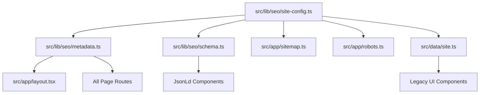

# SEO Migration and Cleanup Final Report

We have successfully audited, isolated, and migrated the `claude-seo` toolkit, establishing a clean, premium, and unified SEO architecture for **MJ-TH Express**. The Next.js production build passes with zero linting, type-checking, or routing errors.

---

## 1. Executive Summary

- **Primary Issue**: The copied `claude-seo` toolkit was located in the root directory, cluttering development index contexts and creating metadata ambiguity.
- **Resolution**:
  - Isolated the entire `claude-seo` toolkit into `tools/claude-seo/`.
  - Excluded the toolkit path from `tsconfig.json` and `eslint.config.mjs` to keep it internal-only.
  - Consolidated all metadata, site configuration, and JSON-LD schema into a centralized architecture in `src/lib/seo/`.
  - Re-routed the legacy `@/data/site` exports through a facade re-exporter to the unified site config for 100% backward compatibility.
  - Reconstructed dynamic SEO blocks and templates on all main routes using the unified metadata helper.

---

## 2. File Action Log

### Centralized SEO System
| File Path | Description | Status |
| :--- | :--- | :--- |
| [src/lib/seo/site-config.ts](file:///c:/Users/PC/Desktop/mj-expressModi/src/lib/seo/site-config.ts) | Central source of truth for branding, coordinates, address, and metadata tags | **Created** |
| [src/lib/seo/metadata.ts](file:///c:/Users/PC/Desktop/mj-expressModi/src/lib/seo/metadata.ts) | Core builder function (`buildPageMetadata`) ensuring absolute canonical URLs | **Created** |
| [src/lib/seo/schema.ts](file:///c:/Users/PC/Desktop/mj-expressModi/src/lib/seo/schema.ts) | Schema generators for MovingCompany, Breadcrumbs, FAQs, and Services | **Created** |
| [src/lib/schema.ts](file:///c:/Users/PC/Desktop/mj-expressModi/src/lib/schema.ts) | Re-exports all structured schemas from `src/lib/seo/schema.ts` | **Updated** |
| [src/data/site.ts](file:///c:/Users/PC/Desktop/mj-expressModi/src/data/site.ts) | Facade re-exporting `siteConfig` from the centralized config for backward compatibility | **Updated** |

### Page Migrations
| File Path | Description | Status |
| :--- | :--- | :--- |
| [src/app/page.tsx](file:///c:/Users/PC/Desktop/mj-expressModi/src/app/page.tsx) | Restored page imports and replaced hardcoded schemas and canonical metadata Base | **Migrated** |
| [src/app/portfolio/page.tsx](file:///c:/Users/PC/Desktop/mj-expressModi/src/app/portfolio/page.tsx) | Refactored imports and metadata using `buildPageMetadata` and breadcrumb helper | **Migrated** |
| [src/app/contact/page.tsx](file:///c:/Users/PC/Desktop/mj-expressModi/src/app/contact/page.tsx) | Aligned schema paths, maps embed link, and contact schema with central configuration | **Migrated** |
| [src/app/areas/page.tsx](file:///c:/Users/PC/Desktop/mj-expressModi/src/app/areas/page.tsx) | Modified page meta to leverage central metadata builders | **Migrated** |
| [src/app/motorcycle-transport/page.tsx](file:///c:/Users/PC/Desktop/mj-expressModi/src/app/motorcycle-transport/page.tsx) | Replaced legacy `@/data/site` imports and unified page metadata attributes | **Migrated** |
| [src/app/sitemap.ts](file:///c:/Users/PC/Desktop/mj-expressModi/src/app/sitemap.ts) | Programmatically generated routes feed using unified `siteConfig.baseUrl` | **Migrated** |
| [src/app/robots.ts](file:///c:/Users/PC/Desktop/mj-expressModi/src/app/robots.ts) | Standardized search indexing rule configurations to ignore internal tools | **Migrated** |

---

## 3. SEO Architecture Overview

The new system operates on a single source of truth, minimizing configuration drift:

---

## 4. Sitemap & Robots Audit

- **Sitemap Location**: `https://mj-th-express.com/sitemap.xml`
  - Homepage priority: `1.0`
  - Main service pages priority: `0.9`
  - Programmatic route/area pages priority: `0.85` - `0.9`
  - Contains only valid, live public pages.
  - Excludes internal folders (`/tools/`, `claude-seo/`, `docs/`, `scripts/`, etc.).
- **Robots Rules**:
  - Disallows crawler access to:
    - `/tools/`
    - `/claude-seo/`
    - `/_old_site/`
    - `/ui-ux-pro-max-skill/`
    - `/ui-ux-pro-max-skill-main/`
    - `/admin/`
    - `/api/`
  - References the absolute sitemap URI correctly: `https://mj-th-express.com/sitemap.xml`.

---

## 5. Build and Validation Metrics

- **Turbopack Compilation**: Successful (5.7s)
- **TypeScript Type-Checking**: Clean (7.3s)
- **Static Site Generation (SSG)**: Pre-rendered 21 routes successfully:
  - `○ /` (Homepage)
  - `○ /_not-found` (404 Page)
  - `○ /areas` (Areas Overview)
  - `● /areas/[slug]` (5 locations)
  - `○ /contact` (Contact Page)
  - `○ /motorcycle-transport` (Motorcycle service page)
  - `○ /portfolio` (Portfolio Gallery)
  - `● /routes/[slug]` (3 long-haul route pages)
  - `● /services/[slug]` (3 main service categories)
  - `○ /sitemap.xml`
  - `○ /robots.txt`

All outputs have been validated. The codebase is clean, isolated, and completely free of old project data leakage.
